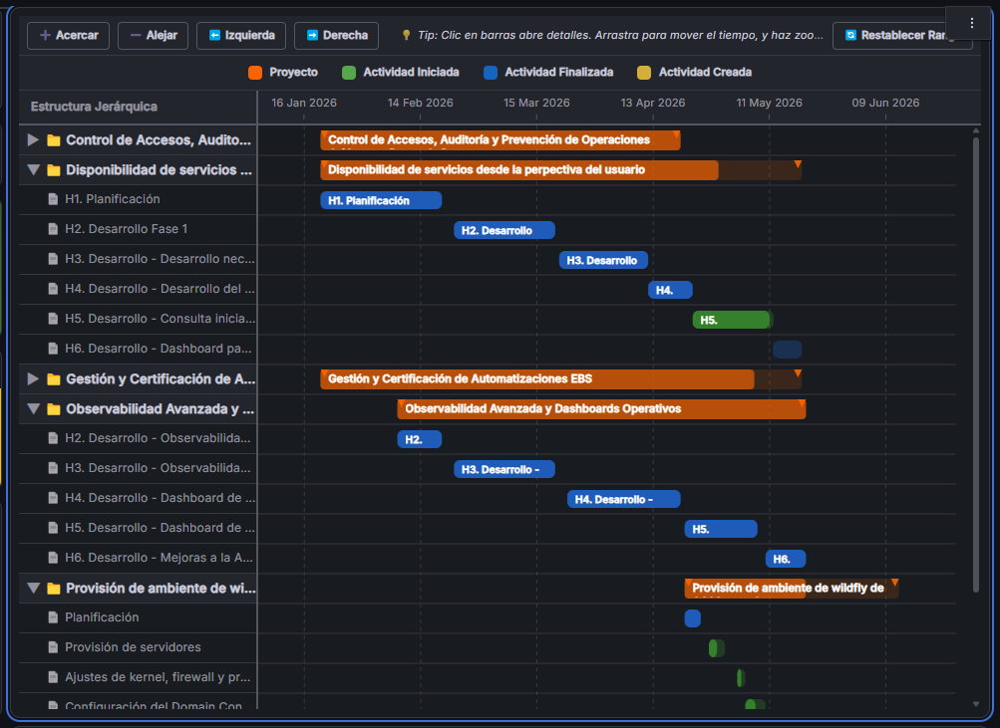

# Cronograma (Gantt) - Panel Plugin de Grafana

Un plugin de panel altamente interactivo, dinámico y estéticamente premium para Grafana que permite visualizar cronogramas y líneas de tiempo tipo **Gantt**.

Desarrollado y mantenido por **DkCorpBo**.



---

## ✨ Características Principales

### 📁 Estructura Jerárquica e Hilos de Agrupación Ilimitados
* **Agrupación en cascada dinámica:** Permite seleccionar múltiples columnas de la consulta de base de datos a través de una barra de etiquetas interactiva (ej: `Gerencia > Equipo > Proyecto`).
* **Niveles ilimitados:** Sin límites artificiales de profundidad. Puedes agrupar tus actividades por tantos niveles jerárquicos como necesites.
* **Colapso/Expansión:** Carpetas y proyectos con controles `▶` y `▼` para optimizar el espacio en dashboards complejos.

### 🟠 Barras de Resumen de Proyectos
* Las agrupaciones de nivel inferior (proyectos) se pintan de forma predeterminada en color **Naranja Premium** (`#E65100`).
* Muestran el nombre del proyecto centrado directamente en su barra.
* Calculan de forma automática la barra de progreso promedio y el rango temporal (fecha mínima y máxima) en base al estado de sus actividades hijas.

### 🎨 Leyenda y Coloreo Automático por Estado (SQL)
* **Colores por Estado Automatizados:** Si no se define un color en la consulta SQL, el plugin lee la columna `Estado` (o `status`) y asigna colores automáticamente:
  * 🟢 **Actividad Iniciada** (`Iniciada`, `Iniciado`, `En Progreso`) -> Verde.
  * 🔵 **Actividad Finalizada** (`Finalizada`, `Finalizado`, `Completado`, `Completada`) -> Azul.
  * 🟡 **Actividad Creada** (`Creada`, `Creado`, `Pendiente`, `Nueva`, `Nuevo`) -> Amarillo/Dorado.
* **100% Configurable:** Puedes activar/desactivar la barra de leyenda superior y personalizar cada uno de estos colores desde la barra lateral derecha del editor.

### 🔍 Controles Temporales Interactivos y Zoom
* **Navegación Intuitiva:** Botones integrados de `Acercar` (Zoom In), `Alejar` (Zoom Out), `Izquierda` (Pan Left), `Derecha` (Pan Right) y `Restablecer Rango` al período temporal de la consulta global de Grafana.
* **Zoom con Rueda:** Haz zoom continuo girando la rueda del ratón (Mouse Wheel Zoom) centrado en la posición de tu cursor.
* **Desplazamiento con Arrastre:** Mantén presionado el clic y arrastra lateralmente para desplazarte (pan/drag) a lo largo del tiempo.
* **Indicador Temporal "Ahora":** Una línea roja vertical discontinua con la etiqueta "Ahora" que se actualiza en tiempo real en base a la hora de tu servidor/máquina local.

### 💬 Sistema de Doble Tooltip (Hover y Clic Fijo)
* **Hover Ligero:** Al pasar el cursor por encima de una barra, aparece de forma instantánea una burbuja oscura que muestra el nombre de la tarea sin bloquear la vista ni clics.
* **Clic Fijo con Detalles:** Al hacer clic izquierdo en una barra de actividad o proyecto, se abre un tooltip interactivo fijo en el punto de clic con:
  * Nombre de la tarea, fechas exactas de inicio y fin, duración y progreso.
  * **Campos Extra Dinámicos:** Puedes definir en una caja de texto qué columnas adicionales de tu consulta (ej: `estado, responsable, prioridad`) quieres mostrar en esta ficha de detalles.
  * **Data Links Integrados:** Un botón con enlace directo (`href` y `target`) para navegar a otras pantallas de detalles nativos de Grafana.

### 📐 Tipografía Ultranítida y Diseños Flexibles
* **Suavizado de Fuente (Font-Smoothing antialiasing):** Aplicado por CSS para garantizar bordes limpios en textos pequeños dentro del SVG.
* **Peso Semibold (600):** Elimina la difuminación/borrosidad en textos pequeños en negrita.
* **Alineación Vertical Fija:** La primera línea de texto de las actividades y proyectos se posiciona de forma fija y verticalmente centrada; si el texto es muy largo, las líneas secundarias fluyen hacia abajo y se recortan limpiamente al borde inferior (`overflow: hidden`) sin mover la línea principal.
* **Tamaños de Letra Configurables:** Ajusta el tamaño de fuente para actividades y proyectos en píxeles de forma independiente.

---

## 🛠️ Requisitos de Desarrollo e Instalación

### Dependencias de Desarrollo
1. Instalar dependencias del proyecto:
   ```bash
   yarn install
   # o bien:
   npm install
   ```

2. Compilar el plugin en modo desarrollo y habilitar el hot-reload en tiempo real:
   ```bash
   yarn run dev
   # o bien:
   npm run dev
   ```

3. Compilar el plugin para producción:
   ```bash
   yarn run build
   # o bien:
   npm run build
   ```

### Distribución y Firma del Plugin
Para utilizar el plugin de manera privada o en servidores de producción sin firmar, puedes habilitar el modo de desarrollo en la configuración de Grafana (`grafana.ini`):
```ini
[plugins]
allow_loading_unsigned_plugins = dkcorpbo-cronograma-gantt-panel
```

---

## 📜 Licencia

Licencia Apache-2.0. Consulta el archivo `LICENSE` para más detalles.
